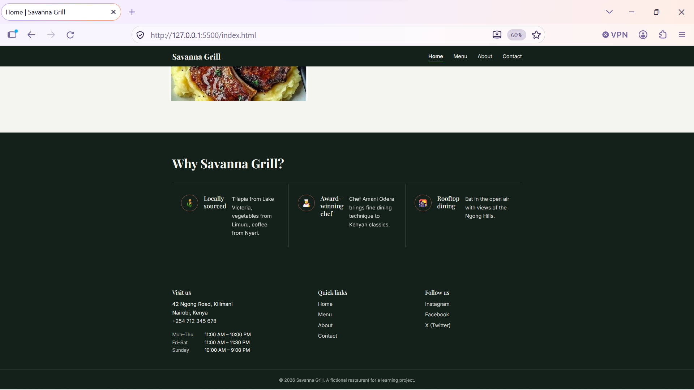
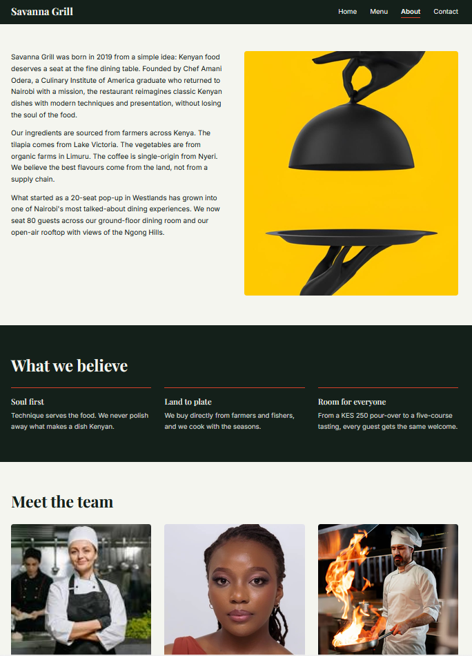
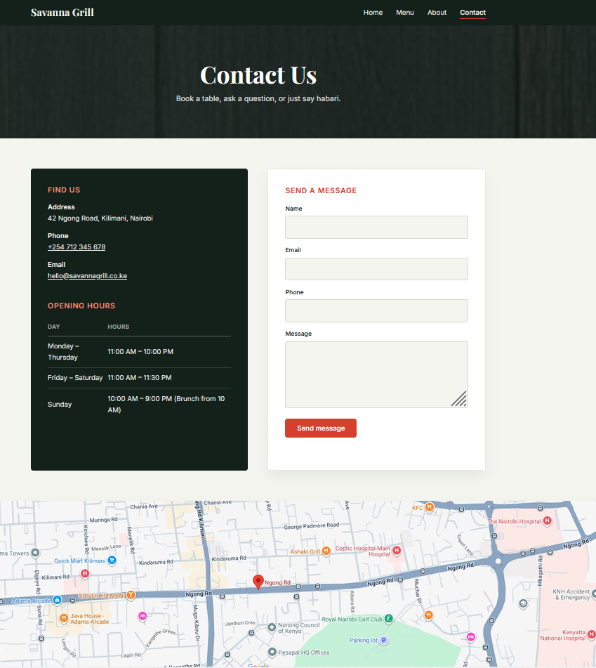

# Savanna Grill

A multi-page restaurant website for **Savanna Grill**, a fictional Kenyan-inspired
restaurant on Ngong Road, Kilimani, Nairobi. Built as a week-1 HTML/CSS project:
semantic markup, Flexbox and Grid layouts, Google Fonts, and a fully responsive
design across mobile, tablet, and desktop — no frameworks, no build step.


## Screenshots

### Home
.png)


### Menu


### About



### Contact



## Pages

| Page | File | Contents |
|---|---|---|
| Home | `index.html` | Hero with background image + CTA, special offer banner, Featured Dishes, "Why Savanna Grill?" |
| Menu | `menu.html` | Breakfast, Lunch, Dinner, Drinks — each item with name, description, and price in KES |
| About | `about.html` | Restaurant story, "What we believe" values, Meet the Team, photo gallery |
| Contact | `contact.html` | Address, phone, email, opening hours, contact form, embedded Google Map |

All four pages share the same navigation bar (current page highlighted) and footer
(address/hours, quick links, social links).


## Project structure

```
savanna-grill/
├── index.html
├── menu.html
├── about.html
├── contact.html
├── styles.css
├── images/
│   ├── index-desktop.png
│   ├── index-mobile.png
│   ├── menu-desktop.png
│   ├── about-desktop.png
│   └── contact-desktop.png
└── README.md
```